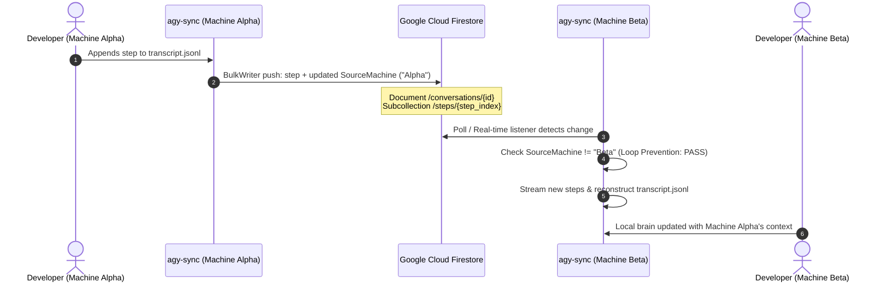
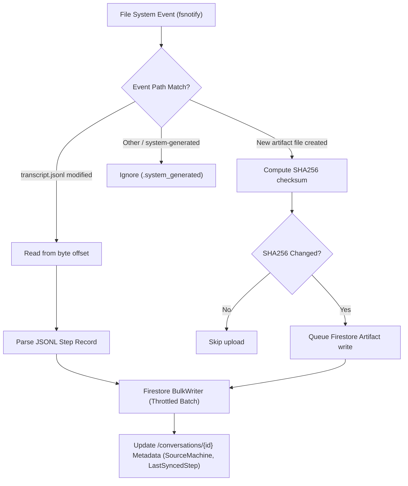

# agy-sync

[](https://golang.org)
[](https://codecov.io/gh/JulienBreux/agy-sync)
[](LICENSE)
[](#)

> **Asynchronous bidirectional synchronization and cloud storage engine for Google Antigravity (AGY) conversations, transcripts, and artifacts.**

---

## Overview

**`agy-sync`** is a high-performance Go CLI and background daemon designed to synchronize Google Antigravity (AGY) sessions across multiple developer workstations in real-time using Google Cloud Firestore.

Antigravity stores session states, tool executions, and generated artifacts locally within `<appDataDir>/brain/<conversation-id>`. When switching between laptops, workstations, or remote environments, conversation history and context are fragmented. `agy-sync` bridges this gap by transforming local session data into an interconnected, queryable, cloud-synchronized file system.

### Key Capabilities

- **Bidirectional Multi-Machine Sync:** Keep *n* machines synchronized in real-time. Changes written on Machine Alpha stream to Firestore and are automatically pulled onto Machine Beta.
- **Append-Only Step Log:** Monotonic step indices (`step_000001`, `step_000002`, ...) prevent merge conflicts, data loss, or out-of-order writes.
- **Byte-for-Byte SQLite Database Sync:** Snapshots active Antigravity WAL databases via `VACUUM INTO` and transfers them chunked (512KB slices) to Firestore with SHA256 integrity validation, guaranteeing 100% authentic tool executions, protobuf payloads, and resumption history across devices (e.g. Google Cloud Shell).
- **Full 21-Column Summary Fidelity:** Synchronizes and strictly mirrors all 21 columns of `conversation_summaries.db` (including `title`, `preview`, `workspace_uris`, `agent_name`, `project_id`, `status`, `battle_id`, `winning_conversation_id`, and protobuf summary blobs), ensuring seamless picker display and session resumption.
- **Cross-Machine Workspace URI Adaptation:** Automatically adapts `workspace_uris` from macOS (`/Users/<user>/...`) or Linux (`/home/<user>/...`) paths to match the target machine's current user home directory, allowing instant history binding and project matching.
- **Typed Trajectory Database Modeling:** Full structural schema support for all 7 Antigravity conversation database tables (`steps`, `trajectory_meta`, `gen_metadata`, `executor_metadata`, `parent_references`, `trajectory_metadata_blob`, `battle_mode_infos`).
- **Automatic Fallback Reconstruction:** If chunked database snapshots are unavailable, the local SQLite database and summaries are reconstructed from transcript JSONL logs automatically.
- **Loop Prevention:** Every sync payload is tagged with the origin machine's unique `MachineID`. Machines automatically ignore echoes of their own updates.
- **Real-time Filesystem Watcher:** Non-blocking `fsnotify` watcher detects incremental transcript appends (`transcript.jsonl`) and new artifact files with sub-second latency and debouncing.
- **Byte-Offset Incremental Streaming:** Efficiently reads only newly appended JSONL bytes without re-parsing entire conversation histories.
- **Offline Transaction Audit Ledger:** High-performance local SQLite database (`~/.config/agy-sync/transactions.db`) recording all inbound (`IMPORT`) and outbound (`EXPORT`) synchronization operations across conversations, artifacts, and brain assets, with directional and entity filtering.
- **Production-Grade Observability:** Leveled logging, structured error messages with user remediation hints, and full `--json` output support for scripting and automation.

---

## Architecture & Data Flow

### Multi-Machine Synchronization Sequence



### Ingestion & Watcher Engine Flow



---

## Firestore Data Schema

`agy-sync` structures conversations in Google Cloud Firestore using a hierarchical subcollection layout:

```
conversations/
└── {conversation_id}
    ├── metadata: {
    │     id, title, preview, step_count, last_user_input_time, created_at, updated_at,
    │     workspace_uris, status, source, project_id, agent_name, parent_conversation_id,
    │     nesting_depth, battle_id, winning_conversation_id, not_fully_idle, killed,
    │     last_user_input_step_index, app_data_dir, raw_summary, group_id,
    │     db_sha256, db_size_bytes, db_chunks_count, last_synced_step, source_machine
    │   }
    ├── steps/
    │   ├── step_000001: { step_index, source, type, status, content, thinking, tool_calls, machine_id, timestamp }
    │   └── step_000002: { ... }
    ├── artifacts/
    │   ├── {artifact_hash_or_name}: { path, mime_type, size_bytes, sha256, content_blob, updated_at }
    │   └── ...
    └── db_chunks/
        ├── 000000: { chunk_index, total_chunks, size_bytes, sha256, data }
        └── 000001: { ... }
```

### Collections & Documents

| Path                                     | Purpose                                   | Key Attributes                                                                 |
| :--------------------------------------- | :---------------------------------------- | :----------------------------------------------------------------------------- |
| `/conversations/{id}`                    | Conversation parent document              | Full 21-column summary metadata, `workspace_uris`, `db_sha256`, `last_synced_step` |
| `/conversations/{id}/steps/{stepIndex}`  | Immutable transcript turn                 | `step_index`, `type`, `source`, `content`, `machine_id`                        |
| `/conversations/{id}/artifacts/{id}`     | User/planner generated artifacts          | `path`, `sha256`, `size_bytes`, `content`                                      |
| `/conversations/{id}/db_chunks/{index}`  | Chunked raw SQLite database slices (512K) | `chunk_index`, `total_chunks`, `size_bytes`, `sha256`, `data`                  |

### Cross-Machine Workspace URI Adaptation

Antigravity stores local project workspaces as absolute file URIs (e.g. `file:///Users/alice/Projects/my-app` on macOS or `file:///home/alice/Projects/my-app` on Linux). When pulling sessions onto a different workstation (e.g. machine user `bob`), `agy-sync` dynamically adapts the workspace URI prefix:
```
file:///Users/alice/Projects/my-app  -->  file:///Users/bob/Projects/my-app
file:///home/alice/Projects/my-app   -->  file:///home/bob/Projects/my-app
```
This guarantees that Antigravity's session selector instantly discovers and links conversations to the active workspace on the current device.

---

## CLI Command Reference

### Global Flags

All commands accept the following persistent flags:

| Flag                  | Description                                          | Default                          |
| :-------------------- | :--------------------------------------------------- | :------------------------------- |
| `--config <path>`     | Path to YAML configuration file                      | `~/.config/agy-sync/config.yaml` |
| `--json`              | Output results formatted as JSON (scripting/CI)      | `false`                          |
| `--log-level <level>` | Minimum log level (`debug`, `info`, `warn`, `error`) | `info`                           |
| `-v, --verbose`       | Enable debug / verbose log streaming                 | `false`                          |

---

### `agy-sync init`
Initializes or updates the configuration file with your Google Cloud Project, Firestore Database, and Machine ID.

```bash
agy-sync init --project-id my-gcp-project [flags]
```

**Flags:**
- `--project-id <string>`: Google Cloud Project ID (*required*).
- `--database-id <string>`: Firestore Database ID (default: `(default)`).
- `--machine-id <string>`: Unique machine identifier (default: current hostname).
- `--brain-dir <path>`: Local Antigravity brain directory (default: `~/.gemini/antigravity-cli/brain`).

---

### `agy-sync push`
Scans local conversations, parses new lines from `transcript.jsonl`, and uploads new steps and artifacts to Firestore.

```bash
# Push all discovered conversations
agy-sync push

# Push a specific conversation
agy-sync push -c 624296c6-d623-4c39-92d4-3906f8c07140
```

**Flags:**
- `-c, --conversation <string>`: Filter push to a specific conversation ID.

---

### `agy-sync pull`
Downloads conversation transcripts and artifacts from Firestore and reconstructs the local Antigravity brain directory, JSONL log structure with exact byte parity, and local SQLite databases (`conversations/<id>.db` and `conversation_summaries.db`).

```bash
# Pull conversation by argument
agy-sync pull 624296c6-d623-4c39-92d4-3906f8c07140

# Or via flag
agy-sync pull -c 624296c6-d623-4c39-92d4-3906f8c07140

# Pull without modifying SQLite databases
agy-sync pull 624296c6-d623-4c39-92d4-3906f8c07140 --no-db-sync
```

**Arguments / Flags:**
- `<conversation-id>`: Unique ID of the conversation in Firestore.
- `-c, --conversation <string>`: Optional flag alternative to specify the conversation ID.
- `--no-db-sync`: Disable SQLite database reconstruction.
- `--conversations-dir <path>`: Path to local conversations directory (default: `~/.gemini/antigravity-cli/conversations`).
- `--summaries-db <path>`: Path to conversation summaries SQLite database (default: `~/.gemini/antigravity-cli/conversation_summaries.db`).

---

### `agy-sync clear`
Purges remote Firestore data stored by `agy-sync`, either for all conversations or for a targeted conversation. Designed for integration testing, QA environments, and development resets.

> [!IMPORTANT]
> **Safety Guarantee:** `agy-sync clear` only modifies remote Firestore collections. It **never** touches, deletes, or alters your local Antigravity brain directories, transcripts, artifacts, or SQLite databases.

```bash
# Clear all conversations from Firestore (with interactive confirmation)
agy-sync clear

# Bypass interactive confirmation (ideal for test automation and CI)
agy-sync clear --force

# Clear only a specific conversation
agy-sync clear -c 624296c6-d623-4c39-92d4-3906f8c07140 --force

# Clear with custom project ID and output JSON result
agy-sync clear --project-id my-gcp-project --force --json
```

**Arguments / Flags:**
- `<conversation-id>`: Optional positional argument specifying a single conversation to delete.
- `-c, --conversation <string>`: Filter deletion to a specific conversation ID.
- `-f, --force`: Bypass interactive confirmation prompt.
- `--project-id <string>`: Google Cloud Project ID (overrides config).
- `--database-id <string>`: Firestore Database ID (overrides config).

---

### `agy-sync start`
Launches the background synchronization daemon. By default, it spawns a detached daemon process monitoring the brain directory and synchronizing with Cloud Firestore.

```bash
# Start background daemon detached
agy-sync start

# Run directly in the foreground
agy-sync start --foreground

# Custom polling interval and debounce
agy-sync start --interval 5s --debounce 500ms

# Specify custom PID and log paths
agy-sync start --pid-file ~/.config/agy-sync/agy-sync.pid --log-file ~/.config/agy-sync/daemon.log
```

**Flags:**
- `-f, --foreground`: Run daemon in the foreground of the current terminal session.
- `--interval <duration>`: Remote Firestore check interval (default: `3s`).
- `--debounce <duration>`: Filesystem event debounce interval (default: `200ms`).
- `--pid-file <path>`: Path to PID file (default: `~/.config/agy-sync/agy-sync.pid`).
- `--log-file <path>`: Path to daemon log file (default: `~/.config/agy-sync/daemon.log`).
- `--no-db-sync`: Disable SQLite database reconstruction during remote pulls.
- `--conversations-dir <path>`: Path to local conversations directory.
- `--summaries-db <path>`: Path to conversation summaries SQLite database.

---

### `agy-sync stop`
Gracefully stops the running background daemon using its PID file and POSIX signals.

```bash
# Stop running daemon
agy-sync stop

# Custom timeout for graceful shutdown
agy-sync stop --timeout 10s
```

**Flags:**
- `--pid-file <path>`: Path to PID file (default: `~/.config/agy-sync/agy-sync.pid`).
- `--log-file <path>`: Path to daemon log file (default: `~/.config/agy-sync/daemon.log`).
- `--timeout <duration>`: Timeout waiting for graceful shutdown before SIGKILL (default: `5s`).

---

### `agy-sync status`
Displays side-by-side synchronization status between your local brain directory and remote Firestore collections, along with daemon process health, SQLite database sync status, and the timestamp of the last remote poll.

```bash
# Terminal formatted table
agy-sync status

# Filter for a single conversation session
agy-sync status 624296c6-d623-4c39-92d4-3906f8c07140

# Machine-readable JSON
agy-sync status --json
```

**Flags:**
- `-c, --conversation <string>`: Filter status display to a specific conversation ID.
- `--pid-file <path>`: Path to PID file (default: `~/.config/agy-sync/agy-sync.pid`).
- `--log-file <path>`: Path to daemon log file (default: `~/.config/agy-sync/daemon.log`).
- `--state-file <path>`: Path to daemon runtime state file (default: `~/.config/agy-sync/daemon.state.json`).
- `--no-db-sync`: Disable SQLite database sync status check.
- `--conversations-dir <path>`: Path to local conversations directory.
- `--summaries-db <path>`: Path to conversation summaries SQLite database.

**Sample Terminal Output:**
```
==================================================
          Antigravity Sync Status
==================================================
Daemon Status:   RUNNING (PID: 12345)
Last Polling:    2026-09-15 14:49:34 UTC (15s ago)
Daemon Log:      /Users/username/.config/agy-sync/daemon.log
GCP Project ID:  my-gcp-project
Machine ID:      macbook-pro
Brain Directory: /Users/username/.gemini/antigravity-cli/brain
Conversations:   /Users/username/.gemini/antigravity-cli/conversations
Summaries DB:    /Users/username/.gemini/antigravity-cli/conversation_summaries.db
SQLite DB Sync:  Enabled
Sessions Found:  1

CONVERSATION ID                        LOCAL STEPS  REMOTE STEPS ARTIFACTS  LOCAL DB  SYNCED
----------------------------------------------------------------------------------------------
624296c6-d623-4c39-92d4-3906f8c07140   42           42           5          Yes       Yes
```

---

### `agy-sync transactions`
Displays an audit log of synchronization transactions between the local Antigravity brain and Firestore. Transactions are persistently stored in a fast local SQLite database (`~/.config/agy-sync/transactions.db`) and capture all inbound (`IMPORT`) and outbound (`EXPORT`) operations for conversations, artifacts, and brain assets.

```bash
# Display recent synchronization transactions (tabular output)
agy-sync transactions

# Filter by direction: IMPORT or EXPORT
agy-sync transactions --in
agy-sync transactions --out
agy-sync transactions --direction in

# Filter by entity type: conversation, artifact, or brain asset
agy-sync transactions --conv
agy-sync transactions --artifact
agy-sync transactions --brain
agy-sync transactions --type artifact

# Filter by conversation ID and limit results
agy-sync transactions -c 624296c6-d623-4c39-92d4-3906f8c07140 --limit 20

# Output machine-readable JSON
agy-sync transactions --json
```

**Flags:**
- `--direction <in|out>`: Filter by transaction direction (`in` for IMPORT, `out` for EXPORT).
- `--in`: Convenience shorthand to filter inbound (`IMPORT`) transactions.
- `--out`: Convenience shorthand to filter outbound (`EXPORT`) transactions.
- `--type <conv|artifact|brain>`: Filter by entity type (`conv`, `artifact`, `brain`).
- `--conv`: Convenience shorthand to filter conversation metadata transactions.
- `--artifact`: Convenience shorthand to filter artifact file transactions.
- `--brain`: Convenience shorthand to filter brain assets (steps & SQLite snapshots).
- `-c, --conversation <string>`: Filter transactions by specific conversation ID.
- `-n, --limit <int>`: Maximum number of transactions to display (default: `50`).
- `--offset <int>`: Number of transactions to skip (default: `0`).
- `--db <path>`: Override path to the local transactions SQLite database.

**Sample Terminal Output:**
```
TIMESTAMP            ACTION    TYPE        CONVERSATION ID                       ENTITY                DETAILS
--------------------------------------------------------------------------------------------------------------
2026-09-19 08:35:10  EXPORT    conv        624296c6-d623-4c39-92d4-3906f8c07140  624296c6-...          steps: 42
2026-09-19 08:35:10  EXPORT    artifact    624296c6-d623-4c39-92d4-3906f8c07140  design.md             size: 1024 bytes
2026-09-19 08:35:10  EXPORT    brain       624296c6-d623-4c39-92d4-3906f8c07140  transcript.jsonl      +3 steps
2026-09-19 08:36:22  IMPORT    brain       624296c6-d623-4c39-92d4-3906f8c07140  transcript.jsonl      +3 steps
```

---

### `agy-sync version`
Displays binary version, git commit hash, build date, Go runtime environment, and target architecture.

```bash
# Text format
agy-sync version

# Machine-readable JSON
agy-sync version --json
```

---

## Configuration Guide

`agy-sync` resolves configuration settings in the following order of precedence:
1. **CLI Flags** (e.g. `--project-id`)
2. **Environment Variables** (`AGY_SYNC_*`)
3. **YAML Configuration File** (`~/.config/agy-sync/config.yaml`)
4. **Built-in Defaults**

### Configuration File (`config.yaml`)

```yaml
# ~/.config/agy-sync/config.yaml
project_id: "my-gcp-project"
database_id: "(default)"
machine_id: "macbook-pro-work"
brain_dir: "/Users/alice/.gemini/antigravity-cli/brain"
conversations_dir: "/Users/alice/.gemini/antigravity-cli/conversations"
summaries_db: "/Users/alice/.gemini/antigravity-cli/conversation_summaries.db"
transactions_db: "/Users/alice/.config/agy-sync/transactions.db"
no_db_sync: false
sync_interval_seconds: 2
log_level: "INFO"
```

### Environment Variables

| Variable                         | Description                                  | Default                                               |
| :------------------------------- | :------------------------------------------- | :---------------------------------------------------- |
| `AGY_SYNC_PROJECT_ID`            | GCP Project ID                               | *(None)*                                              |
| `AGY_SYNC_DATABASE_ID`           | Firestore Database ID                        | `(default)`                                           |
| `AGY_SYNC_MACHINE_ID`            | Unique machine identifier                    | Hostname                                              |
| `AGY_SYNC_BRAIN_DIR`             | Antigravity brain path                       | `~/.gemini/antigravity-cli/brain`                     |
| `AGY_SYNC_CONVERSATIONS_DIR`     | Antigravity conversations directory          | `~/.gemini/antigravity-cli/conversations`             |
| `AGY_SYNC_SUMMARIES_DB`          | Path to conversation summaries SQLite DB     | `~/.gemini/antigravity-cli/conversation_summaries.db` |
| `AGY_SYNC_TRANSACTIONS_DB`       | Path to transactions SQLite DB               | `~/.config/agy-sync/transactions.db`                  |
| `AGY_SYNC_NO_DB_SYNC`            | Disable SQLite database reconstruction       | `false`                                               |
| `AGY_SYNC_SYNC_INTERVAL_SECONDS` | Polling interval                             | `2`                                                   |
| `AGY_SYNC_LOG_LEVEL`             | Log level (`DEBUG`, `INFO`, `WARN`, `ERROR`) | `INFO`                                                |

> [!NOTE]
> For backwards compatibility, `agy-sync` also accepts legacy `AYG_SYNC_*` environment variables if `AGY_SYNC_*` is unset.

---

## Authentication (Google Cloud ADC)

`agy-sync` uses Google Cloud **Application Default Credentials (ADC)** to authenticate with Firestore. No hardcoded keys or secrets are required.

### Local Developer Workstations
Authenticate using the Google Cloud CLI:

```bash
gcloud auth application-default login
```

### Headless Servers & Service Accounts
Set the `GOOGLE_APPLICATION_CREDENTIALS` environment variable pointing to your downloaded service account JSON key:

```bash
export GOOGLE_APPLICATION_CREDENTIALS="/path/to/service-account-key.json"
```

**Required IAM Roles:**
- `roles/datastore.user` (Cloud Datastore User / Firestore User) or `roles/datastore.owner`

---

## Developer Guide & Testing

### Building from Source

Ensure you have **Go 1.27+** installed:

```bash
# Clone the repository
git clone https://github.com/julienbreux/agy-sync.git
cd agy-sync

# Build the static executable into bin/
go build -v -o bin/agy-sync .

# Verify binary
./bin/agy-sync --help
```

### Running Automated Unit Tests

Run the full automated test suite with coverage report:

```bash
CI=true go test -v -cover ./...
```

### Running with the Local Firestore Emulator

Hermetic tests for real Firestore client operations and round-trip E2E sync can be executed against a local Firestore emulator:

```bash
# 1. Start the Google Cloud Firestore Emulator in a background terminal:
gcloud emulators firestore start --host-port=127.0.0.1:8080

# 2. In your working shell, export the emulator host:
export FIRESTORE_EMULATOR_HOST="127.0.0.1:8080"

# 3. Run all tests including live emulator suites:
CI=true go test -v ./pkg/firestore/... ./test/...
```

### Code Quality & Static Analysis

We enforce strict linting and idiomatic Go practices:

```bash
golangci-lint run ./...
```

---

## Contributing

Contributions, feedback, and pull requests are welcome!

1. Fork the repository and create your feature branch: `git checkout -b feat/my-new-feature`
2. Follow Test-Driven Development (TDD): write unit tests ensuring coverage stays above 80%
3. Verify your changes: `CI=true go test ./... && golangci-lint run ./...`
4. Commit your changes with conventional commit messages: `git commit -m "feat(syncer): add compression support"`
5. Push to the branch and open a Pull Request

---

## License

This project is licensed under the **Apache License, Version 2.0**. See the [LICENSE](LICENSE) file for details.

```
Copyright 2026 Julien Breux

Licensed under the Apache License, Version 2.0 (the "License");
you may not use this file except in compliance with the License.
You may obtain a copy of the License at

    http://www.apache.org/licenses/LICENSE-2.0

Unless required by applicable law or agreed to in writing, software
distributed under the License is distributed on an "AS IS" BASIS,
WITHOUT WARRANTIES OR CONDITIONS OF ANY KIND, either express or implied.
See the License for the specific language governing permissions and
limitations under the License.
```
