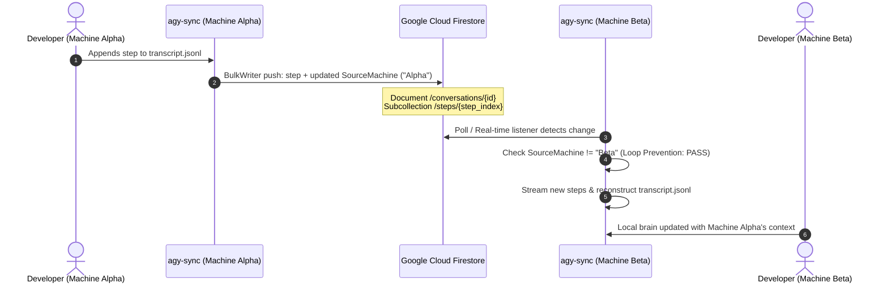
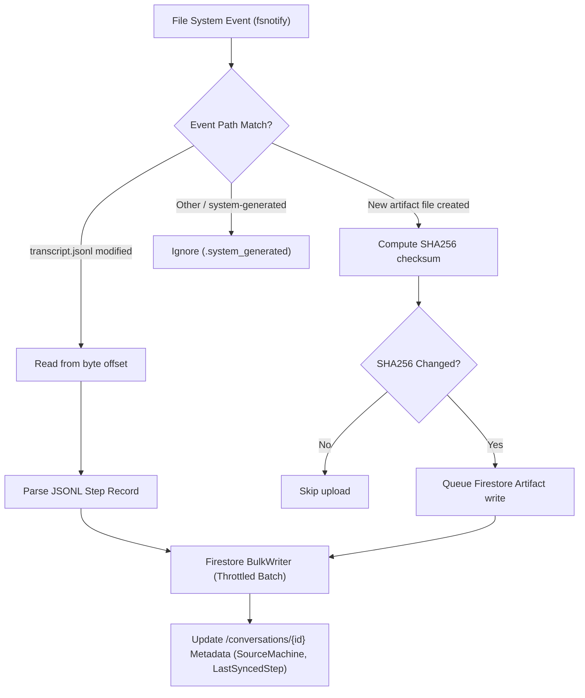

# agy-sync

[](https://golang.org)
[](LICENSE)
[](#)

> **Asynchronous bidirectional synchronization and cloud storage engine for Google Antigravity (AGY) conversations, transcripts, and artifacts.**

---

## Overview

**`agy-sync`** is a high-performance Go CLI and background daemon designed to synchronize Google Antigravity (AGY) sessions across multiple developer workstations in real-time using Google Cloud Firestore.

Antigravity stores session states, tool executions, and generated artifacts locally within `<appDataDir>/brain/<conversation-id>`. When switching between laptops, workstations, or remote environments, conversation history and context are fragmented. `agy-sync` bridges this gap by transforming local session data into an interconnected, queryable, cloud-synchronized file system.

### Key Capabilities

- **Bidirectional Multi-Machine Sync:** Keep *n* machines synchronized in real-time. Changes written on Machine Alpha stream to Firestore and are automatically pulled onto Machine Beta.
- **Append-Only Step Log:** Monotonic step indices (`step_000001`, `step_000002`, ...) prevent merge conflicts, data loss, or out-of-order writes.
- **Loop Prevention:** Every sync payload is tagged with the origin machine's unique `MachineID`. Machines automatically ignore echoes of their own updates.
- **Real-time Filesystem Watcher:** Non-blocking `fsnotify` watcher detects incremental transcript appends (`transcript.jsonl`) and new artifact files with sub-second latency and debouncing.
- **Byte-Offset Incremental Streaming:** Efficiently reads only newly appended JSONL bytes without re-parsing entire conversation histories.
- **Artifact Hash Deduplication:** SHA256 checksum comparison avoids redundant network uploads for unchanged artifacts.
- **Production-Grade Observability:** Leveled logging, structured error messages with user remediation hints, and full `--json` output support for scripting and automation.

---

## Architecture & Data Flow

### Multi-Machine Synchronization Sequence



### Ingestion & Watcher Engine Flow



---

## Firestore Data Schema

`agy-sync` structures conversations in Google Cloud Firestore using a hierarchical subcollection layout:

```
conversations/
└── {conversation_id}
    ├── metadata: { id, title, created_at, updated_at, last_synced_step, source_machine }
    ├── steps/
    │   ├── step_000001: { step_index, source, type, status, content, thinking, tool_calls, machine_id, timestamp }
    │   └── step_000002: { ... }
    └── artifacts/
        ├── {artifact_hash_or_name}: { path, mime_type, size_bytes, sha256, content_blob, updated_at }
        └── ...
```

### Collections & Documents

| Path | Purpose | Key Attributes |
| :--- | :--- | :--- |
| `/conversations/{id}` | Conversation parent document | `last_synced_step`, `source_machine`, `updated_at` |
| `/conversations/{id}/steps/{stepIndex}` | Immutable transcript turn | `step_index`, `type`, `source`, `content`, `machine_id` |
| `/conversations/{id}/artifacts/{id}` | User/planner generated artifacts | `path`, `sha256`, `size_bytes`, `content` |

---
