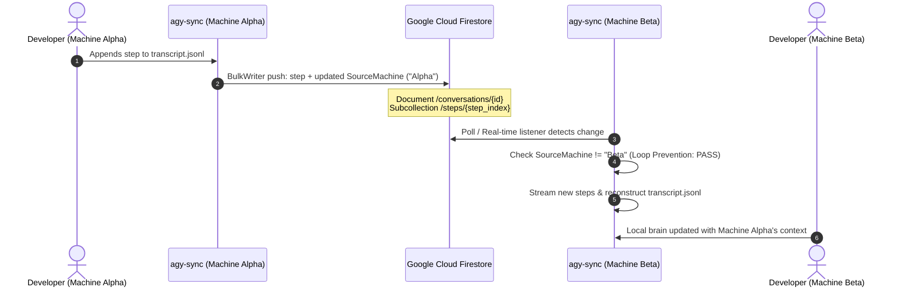
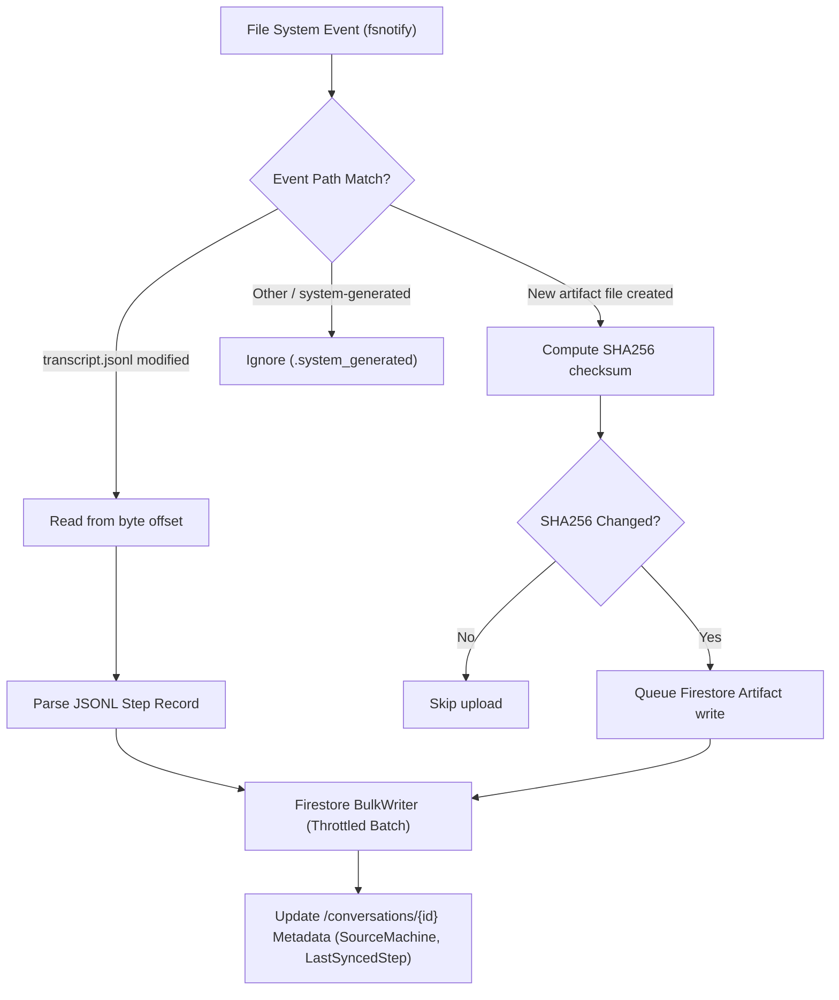

# agy-sync

[](https://golang.org)
[](LICENSE)
[](#)

> **Asynchronous bidirectional synchronization and cloud storage engine for Google Antigravity (AGY) conversations, transcripts, and artifacts.**

---

## Overview

**`agy-sync`** is a high-performance Go CLI and background daemon designed to synchronize Google Antigravity (AGY) sessions across multiple developer workstations in real-time using Google Cloud Firestore.

Antigravity stores session states, tool executions, and generated artifacts locally within `<appDataDir>/brain/<conversation-id>`. When switching between laptops, workstations, or remote environments, conversation history and context are fragmented. `agy-sync` bridges this gap by transforming local session data into an interconnected, queryable, cloud-synchronized file system.

### Key Capabilities

- **Bidirectional Multi-Machine Sync:** Keep *n* machines synchronized in real-time. Changes written on Machine Alpha stream to Firestore and are automatically pulled onto Machine Beta.
- **Append-Only Step Log:** Monotonic step indices (`step_000001`, `step_000002`, ...) prevent merge conflicts, data loss, or out-of-order writes.
- **Loop Prevention:** Every sync payload is tagged with the origin machine's unique `MachineID`. Machines automatically ignore echoes of their own updates.
- **Real-time Filesystem Watcher:** Non-blocking `fsnotify` watcher detects incremental transcript appends (`transcript.jsonl`) and new artifact files with sub-second latency and debouncing.
- **Byte-Offset Incremental Streaming:** Efficiently reads only newly appended JSONL bytes without re-parsing entire conversation histories.
- **Artifact Hash Deduplication:** SHA256 checksum comparison avoids redundant network uploads for unchanged artifacts.
- **Production-Grade Observability:** Leveled logging, structured error messages with user remediation hints, and full `--json` output support for scripting and automation.

---

## Architecture & Data Flow

### Multi-Machine Synchronization Sequence



### Ingestion & Watcher Engine Flow



---

## Firestore Data Schema

`agy-sync` structures conversations in Google Cloud Firestore using a hierarchical subcollection layout:

```
conversations/
└── {conversation_id}
    ├── metadata: { id, title, created_at, updated_at, last_synced_step, source_machine }
    ├── steps/
    │   ├── step_000001: { step_index, source, type, status, content, thinking, tool_calls, machine_id, timestamp }
    │   └── step_000002: { ... }
    └── artifacts/
        ├── {artifact_hash_or_name}: { path, mime_type, size_bytes, sha256, content_blob, updated_at }
        └── ...
```

### Collections & Documents

| Path | Purpose | Key Attributes |
| :--- | :--- | :--- |
| `/conversations/{id}` | Conversation parent document | `last_synced_step`, `source_machine`, `updated_at` |
| `/conversations/{id}/steps/{stepIndex}` | Immutable transcript turn | `step_index`, `type`, `source`, `content`, `machine_id` |
| `/conversations/{id}/artifacts/{id}` | User/planner generated artifacts | `path`, `sha256`, `size_bytes`, `content` |

---

## CLI Command Reference

### Global Flags

All commands accept the following persistent flags:

| Flag | Description | Default |
| :--- | :--- | :--- |
| `--config <path>` | Path to YAML configuration file | `~/.config/agy-sync/config.yaml` |
| `--json` | Output results formatted as JSON (scripting/CI) | `false` |
| `-v, --verbose` | Enable debug / verbose log streaming | `false` |

---

### `agy-sync init`
Initializes or updates the configuration file with your Google Cloud Project, Firestore Database, and Machine ID.

```bash
agy-sync init --project-id my-gcp-project [flags]
```

**Flags:**
- `--project-id <string>`: Google Cloud Project ID (*required*).
- `--database-id <string>`: Firestore Database ID (default: `(default)`).
- `--machine-id <string>`: Unique machine identifier (default: current hostname).
- `--brain-dir <path>`: Local Antigravity brain directory (default: `~/.gemini/antigravity-cli/brain`).

---

### `agy-sync push`
Scans local conversations, parses new lines from `transcript.jsonl`, and uploads new steps and artifacts to Firestore.

```bash
# Push all discovered conversations
agy-sync push

# Push a specific conversation
agy-sync push -c 624296c6-d623-4c39-92d4-3906f8c07140
```

**Flags:**
- `-c, --conversation <string>`: Filter push to a specific conversation ID.

---

### `agy-sync pull`
Downloads conversation transcripts and artifacts from Firestore and reconstructs the local Antigravity brain directory and JSONL log structure with exact byte parity.

```bash
# Pull conversation by argument
agy-sync pull 624296c6-d623-4c39-92d4-3906f8c07140

# Or via flag
agy-sync pull -c 624296c6-d623-4c39-92d4-3906f8c07140
```

**Arguments / Flags:**
- `<conversation-id>`: Unique ID of the conversation in Firestore.
- `-c, --conversation <string>`: Optional flag alternative to specify the conversation ID.

---

### `agy-sync start`
Launches the background synchronization daemon. By default, it spawns a detached daemon process monitoring the brain directory and synchronizing with Cloud Firestore.

```bash
# Start background daemon detached
agy-sync start

# Run directly in the foreground
agy-sync start --foreground

# Custom polling interval and debounce
agy-sync start --interval 5s --debounce 500ms

# Specify custom PID and log paths
agy-sync start --pid-file ~/.config/agy-sync/agy-sync.pid --log-file ~/.config/agy-sync/daemon.log
```

**Flags:**
- `-f, --foreground`: Run daemon in the foreground of the current terminal session.
- `--interval <duration>`: Remote Firestore check interval (default: `3s`).
- `--debounce <duration>`: Filesystem event debounce interval (default: `200ms`).
- `--pid-file <path>`: Path to PID file (default: `~/.config/agy-sync/agy-sync.pid`).
- `--log-file <path>`: Path to daemon log file (default: `~/.config/agy-sync/daemon.log`).

---

### `agy-sync stop`
Gracefully stops the running background daemon using its PID file and POSIX signals.

```bash
# Stop running daemon
agy-sync stop

# Custom timeout for graceful shutdown
agy-sync stop --timeout 10s
```

**Flags:**
- `--pid-file <path>`: Path to PID file (default: `~/.config/agy-sync/agy-sync.pid`).
- `--log-file <path>`: Path to daemon log file (default: `~/.config/agy-sync/daemon.log`).
- `--timeout <duration>`: Timeout waiting for graceful shutdown before SIGKILL (default: `5s`).

---

### `agy-sync status`
Displays side-by-side synchronization status between your local brain directory and remote Firestore collections, along with daemon process health.

```bash
# Terminal formatted table
agy-sync status

# Machine-readable JSON
agy-sync status --json
```

**Sample Terminal Output:**
```
==================================================
          Antigravity Sync Status                
==================================================
Daemon Status:   RUNNING (PID: 12345)
Daemon Log:      /Users/username/.config/agy-sync/daemon.log
GCP Project ID:  my-gcp-project
Machine ID:      macbook-pro
Brain Directory: /Users/username/.gemini/antigravity-cli/brain
Sessions Found:  1

CONVERSATION ID                        LOCAL STEPS  REMOTE STEPS ARTIFACTS  SYNCED  
------------------------------------------------------------------------------------
624296c6-d623-4c39-92d4-3906f8c07140   42           42           5          Yes     
```

---

## Configuration Guide

`agy-sync` resolves configuration settings in the following order of precedence:
1. **CLI Flags** (e.g. `--project-id`)
2. **Environment Variables** (`AGY_SYNC_*`)
3. **YAML Configuration File** (`~/.config/agy-sync/config.yaml`)
4. **Built-in Defaults**

### Configuration File (`config.yaml`)

```yaml
# ~/.config/agy-sync/config.yaml
project_id: "my-gcp-project"
database_id: "(default)"
machine_id: "macbook-pro-work"
brain_dir: "/Users/alice/.gemini/antigravity-cli/brain"
sync_interval_seconds: 2
log_level: "INFO"
```

### Environment Variables

| Variable | Description | Default |
| :--- | :--- | :--- |
| `AGY_SYNC_PROJECT_ID` | GCP Project ID | *(None)* |
| `AGY_SYNC_DATABASE_ID` | Firestore Database ID | `(default)` |
| `AGY_SYNC_MACHINE_ID` | Unique machine identifier | Hostname |
| `AGY_SYNC_BRAIN_DIR` | Antigravity brain path | `~/.gemini/antigravity-cli/brain` |
| `AGY_SYNC_SYNC_INTERVAL_SECONDS` | Polling interval | `2` |
| `AGY_SYNC_LOG_LEVEL` | Log level (`DEBUG`, `INFO`, `WARN`, `ERROR`) | `INFO` |

> [!NOTE]
> For backwards compatibility, `agy-sync` also accepts legacy `AYG_SYNC_*` environment variables if `AGY_SYNC_*` is unset.

---

## Authentication (Google Cloud ADC)

`agy-sync` uses Google Cloud **Application Default Credentials (ADC)** to authenticate with Firestore. No hardcoded keys or secrets are required.

### Local Developer Workstations
Authenticate using the Google Cloud CLI:

```bash
gcloud auth application-default login
```

### Headless Servers & Service Accounts
Set the `GOOGLE_APPLICATION_CREDENTIALS` environment variable pointing to your downloaded service account JSON key:

```bash
export GOOGLE_APPLICATION_CREDENTIALS="/path/to/service-account-key.json"
```

**Required IAM Roles:**
- `roles/datastore.user` (Cloud Datastore User / Firestore User) or `roles/datastore.owner`

---

## Developer Guide & Testing

### Building from Source

Ensure you have **Go 1.27+** installed:

```bash
# Clone the repository
git clone https://github.com/julienbreux/agy-sync.git
cd agy-sync

# Build the static executable into bin/
go build -v -o bin/agy-sync .

# Verify binary
./bin/agy-sync --help
```

### Running Automated Unit Tests

Run the full automated test suite with coverage report:

```bash
CI=true go test -v -cover ./...
```

### Running with the Local Firestore Emulator

Hermetic tests for real Firestore client operations and round-trip E2E sync can be executed against a local Firestore emulator:

```bash
# 1. Start the Google Cloud Firestore Emulator in a background terminal:
gcloud emulators firestore start --host-port=127.0.0.1:8080

# 2. In your working shell, export the emulator host:
export FIRESTORE_EMULATOR_HOST="127.0.0.1:8080"

# 3. Run all tests including live emulator suites:
CI=true go test -v ./pkg/firestore/... ./test/...
```

### Code Quality & Static Analysis

We enforce strict linting and idiomatic Go practices:

```bash
golangci-lint run ./...
```

---

## Contributing

Contributions, feedback, and pull requests are welcome!

1. Fork the repository and create your feature branch: `git checkout -b feat/my-new-feature`
2. Follow Test-Driven Development (TDD): write unit tests ensuring coverage stays above 80%
3. Verify your changes: `CI=true go test ./... && golangci-lint run ./...`
4. Commit your changes with conventional commit messages: `git commit -m "feat(syncer): add compression support"`
5. Push to the branch and open a Pull Request

---

## License

This project is licensed under the **Apache License, Version 2.0**. See the [LICENSE](LICENSE) file for details.

```
Copyright 2026 Julien Breux

Licensed under the Apache License, Version 2.0 (the "License");
you may not use this file except in compliance with the License.
You may obtain a copy of the License at

    http://www.apache.org/licenses/LICENSE-2.0

Unless required by applicable law or agreed to in writing, software
distributed under the License is distributed on an "AS IS" BASIS,
WITHOUT WARRANTIES OR CONDITIONS OF ANY KIND, either express or implied.
See the License for the specific language governing permissions and
limitations under the License.
```
