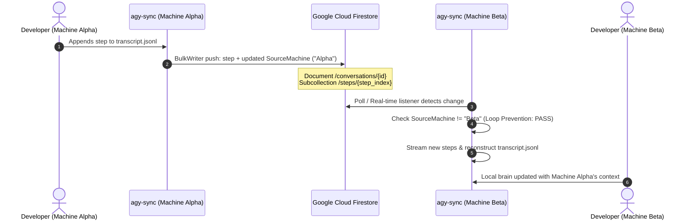
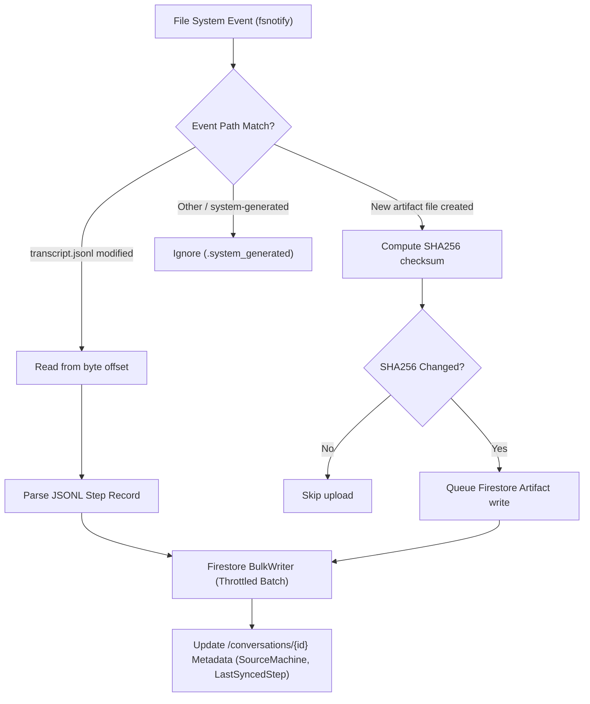

# agy-sync

[](https://golang.org)
[](LICENSE)
[](#)

> **Asynchronous bidirectional synchronization and cloud storage engine for Google Antigravity (AGY) conversations, transcripts, and artifacts.**

---

## Overview

**`agy-sync`** is a high-performance Go CLI and background daemon designed to synchronize Google Antigravity (AGY) sessions across multiple developer workstations in real-time using Google Cloud Firestore.

Antigravity stores session states, tool executions, and generated artifacts locally within `<appDataDir>/brain/<conversation-id>`. When switching between laptops, workstations, or remote environments, conversation history and context are fragmented. `agy-sync` bridges this gap by transforming local session data into an interconnected, queryable, cloud-synchronized file system.

### Key Capabilities

- **Bidirectional Multi-Machine Sync:** Keep *n* machines synchronized in real-time. Changes written on Machine Alpha stream to Firestore and are automatically pulled onto Machine Beta.
- **Append-Only Step Log:** Monotonic step indices (`step_000001`, `step_000002`, ...) prevent merge conflicts, data loss, or out-of-order writes.
- **Loop Prevention:** Every sync payload is tagged with the origin machine's unique `MachineID`. Machines automatically ignore echoes of their own updates.
- **Real-time Filesystem Watcher:** Non-blocking `fsnotify` watcher detects incremental transcript appends (`transcript.jsonl`) and new artifact files with sub-second latency and debouncing.
- **Byte-Offset Incremental Streaming:** Efficiently reads only newly appended JSONL bytes without re-parsing entire conversation histories.
- **Artifact Hash Deduplication:** SHA256 checksum comparison avoids redundant network uploads for unchanged artifacts.
- **Production-Grade Observability:** Leveled logging, structured error messages with user remediation hints, and full `--json` output support for scripting and automation.

---

## Architecture & Data Flow

### Multi-Machine Synchronization Sequence



### Ingestion & Watcher Engine Flow



---

## Firestore Data Schema

`agy-sync` structures conversations in Google Cloud Firestore using a hierarchical subcollection layout:

```
conversations/
└── {conversation_id}
    ├── metadata: { id, title, created_at, updated_at, last_synced_step, source_machine }
    ├── steps/
    │   ├── step_000001: { step_index, source, type, status, content, thinking, tool_calls, machine_id, timestamp }
    │   └── step_000002: { ... }
    └── artifacts/
        ├── {artifact_hash_or_name}: { path, mime_type, size_bytes, sha256, content_blob, updated_at }
        └── ...
```

### Collections & Documents

| Path | Purpose | Key Attributes |
| :--- | :--- | :--- |
| `/conversations/{id}` | Conversation parent document | `last_synced_step`, `source_machine`, `updated_at` |
| `/conversations/{id}/steps/{stepIndex}` | Immutable transcript turn | `step_index`, `type`, `source`, `content`, `machine_id` |
| `/conversations/{id}/artifacts/{id}` | User/planner generated artifacts | `path`, `sha256`, `size_bytes`, `content` |

---

## CLI Command Reference

### Global Flags

All commands accept the following persistent flags:

| Flag | Description | Default |
| :--- | :--- | :--- |
| `--config <path>` | Path to YAML configuration file | `~/.config/agy-sync/config.yaml` |
| `--json` | Output results formatted as JSON (scripting/CI) | `false` |
| `-v, --verbose` | Enable debug / verbose log streaming | `false` |

---

### `agy-sync init`
Initializes or updates the configuration file with your Google Cloud Project, Firestore Database, and Machine ID.

```bash
agy-sync init --project-id my-gcp-project [flags]
```

**Flags:**
- `--project-id <string>`: Google Cloud Project ID (*required*).
- `--database-id <string>`: Firestore Database ID (default: `(default)`).
- `--machine-id <string>`: Unique machine identifier (default: current hostname).
- `--brain-dir <path>`: Local Antigravity brain directory (default: `~/.gemini/antigravity-cli/brain`).

---

### `agy-sync push`
Scans local conversations, parses new lines from `transcript.jsonl`, and uploads new steps and artifacts to Firestore.

```bash
# Push all discovered conversations
agy-sync push

# Push a specific conversation
agy-sync push --conversation-id 624296c6-d623-4c39-92d4-3906f8c07140

# Custom brain directory
agy-sync push --dir /path/to/custom/brain
```

**Flags:**
- `--conversation-id <string>`: Filter push to a single conversation ID.
- `--dir <string>`: Override the brain root directory.

---

### `agy-sync pull`
Reconstructs an Antigravity conversation locally from Firestore, re-creating directory trees, streaming steps into `transcript.jsonl`, and saving artifacts with exact byte parity.

```bash
# Pull conversation by ID
agy-sync pull 624296c6-d623-4c39-92d4-3906f8c07140

# Pull to custom directory
agy-sync pull 624296c6-d623-4c39-92d4-3906f8c07140 --dir /path/to/custom/brain
```

**Arguments:**
- `<conversation-id>`: Unique ID of the conversation in Firestore (*required*).

---

### `agy-sync watch`
Runs a persistent background daemon that watches local Antigravity directories with `fsnotify` and polls Firestore for remote changes made by other workstations.

```bash
# Start watch daemon
agy-sync watch

# Custom polling interval (seconds)
agy-sync watch --poll-interval 5
```

**Flags:**
- `--poll-interval <int>`: Remote Firestore polling interval in seconds (default: `2`).
- `--dir <string>`: Override the brain root directory.

---

### `agy-sync status`
Displays side-by-side synchronization status between your local brain directory and remote Firestore collections.

```bash
# Terminal formatted table
agy-sync status

# Filter specific conversation
agy-sync status --conversation-id 624296c6-d623-4c39-92d4-3906f8c07140

# Machine-readable JSON
agy-sync status --json
```

**Sample Terminal Output:**
```
CONVERSATION ID                          LOCAL STEPS  REMOTE STEPS  LOCAL ARTIFACTS  REMOTE ARTIFACTS  SYNCED
624296c6-d623-4c39-92d4-3906f8c07140     42           42            5                5                 YES
```

---

## Configuration Guide

`agy-sync` resolves configuration settings in the following order of precedence:
1. **CLI Flags** (e.g. `--project-id`)
2. **Environment Variables** (`AGY_SYNC_*`)
3. **YAML Configuration File** (`~/.config/agy-sync/config.yaml`)
4. **Built-in Defaults**

### Configuration File (`config.yaml`)

```yaml
# ~/.config/agy-sync/config.yaml
project_id: "my-gcp-project"
database_id: "(default)"
machine_id: "macbook-pro-work"
brain_dir: "/Users/alice/.gemini/antigravity-cli/brain"
sync_interval_seconds: 2
log_level: "INFO"
```

### Environment Variables

| Variable | Description | Default |
| :--- | :--- | :--- |
| `AGY_SYNC_PROJECT_ID` | GCP Project ID | *(None)* |
| `AGY_SYNC_DATABASE_ID` | Firestore Database ID | `(default)` |
| `AGY_SYNC_MACHINE_ID` | Unique machine identifier | Hostname |
| `AGY_SYNC_BRAIN_DIR` | Antigravity brain path | `~/.gemini/antigravity-cli/brain` |
| `AGY_SYNC_SYNC_INTERVAL_SECONDS` | Polling interval | `2` |
| `AGY_SYNC_LOG_LEVEL` | Log level (`DEBUG`, `INFO`, `WARN`, `ERROR`) | `INFO` |

> [!NOTE]
> For backwards compatibility, `agy-sync` also accepts legacy `AYG_SYNC_*` environment variables if `AGY_SYNC_*` is unset.

---

## Authentication (Google Cloud ADC)

`agy-sync` uses Google Cloud **Application Default Credentials (ADC)** to authenticate with Firestore. No hardcoded keys or secrets are required.

### Local Developer Workstations
Authenticate using the Google Cloud CLI:

```bash
gcloud auth application-default login
```

### Headless Servers & Service Accounts
Set the `GOOGLE_APPLICATION_CREDENTIALS` environment variable pointing to your downloaded service account JSON key:

```bash
export GOOGLE_APPLICATION_CREDENTIALS="/path/to/service-account-key.json"
```

**Required IAM Roles:**
- `roles/datastore.user` (Cloud Datastore User / Firestore User) or `roles/datastore.owner`
