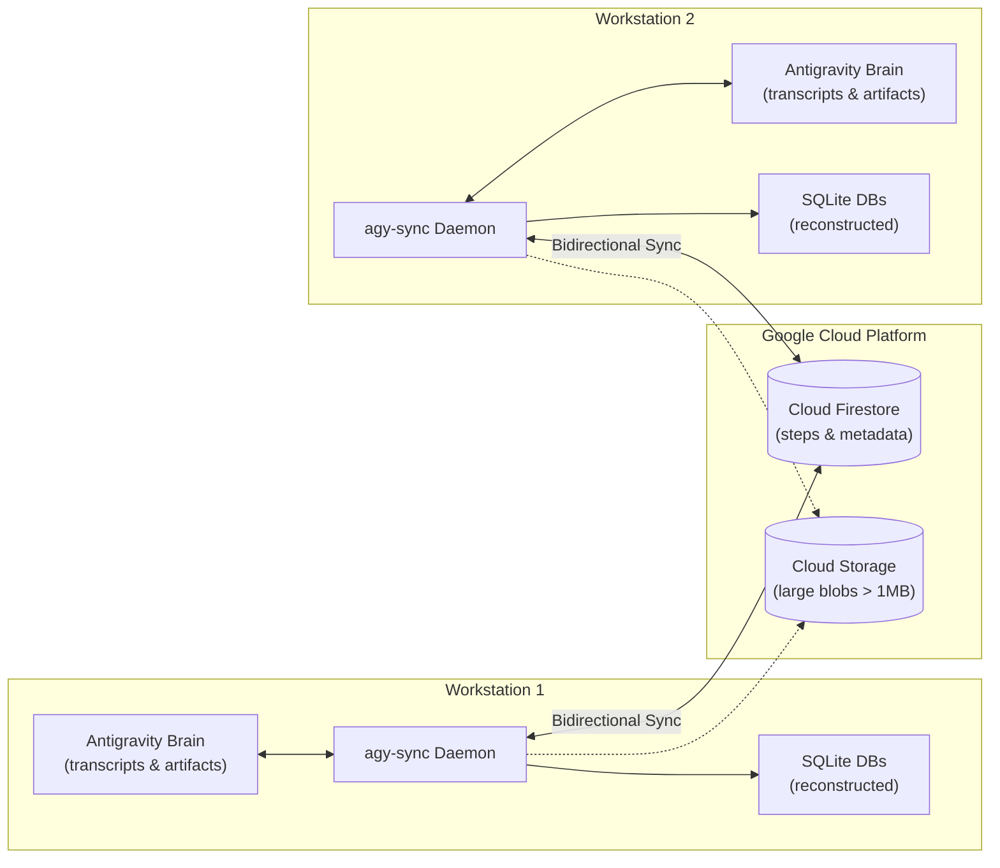

# agy-sync

[](https://golang.org)
[](https://codecov.io/gh/JulienBreux/agy-sync)
[](LICENSE)
[](docs/README.md)

> **Asynchronous bidirectional synchronization and cloud storage engine for Google Antigravity (AGY) sessions across developer workstations.**

---

## Overview

**`agy-sync`** bridges your local Google Antigravity workspaces (`~/.gemini/antigravity-cli/brain/`) and Google Cloud Firestore. It enables continuous, real-time synchronization of conversations, execution steps, tool interactions, and artifacts across multiple workstations without merge conflicts or context loss.



### Highlights

- 🔄 **Real-Time Bidirectional Sync:** Append-only step trajectories synchronized automatically across *n* machines.
- 🛡️ **Zero Conflict Loop Prevention:** Every sync payload is tagged with an origin `MachineID` to prevent echo loops.
- 🗄️ **SQLite Reconstruction:** Dynamically rebuilds local `conversations.db` and `conversation_summaries.db` with full 21-column fidelity.
- ⚡ **Background Daemon & Watcher:** Non-blocking `fsnotify` watcher debounces filesystem events for sub-second synchronization.
- 📊 **Interactive TUI Pager:** Responsive terminal viewport (`agy-sync status --full`) for navigating conversation history.
- 📜 **Audit Ledger:** Fast local SQLite transaction log (`agy-sync transactions`) tracking inbound and outbound sync operations.
- ☁️ **Automated Cloud Provisioning:** Self-diagnostic setup command (`agy-sync setup`) with dry-run capabilities.

---

## ⚡ 3-Step Quickstart

### 1. Install

```bash
# Clone and build
git clone https://github.com/julienbreux/agy-sync.git
cd agy-sync
go install .
```

### 2. Configure & Verify GCP

Ensure [Application Default Credentials (ADC)](https://cloud.google.com/docs/authentication/application-default-credentials) are configured, then run the automated diagnostic setup:

```bash
# Authenticate with Google Cloud
gcloud auth application-default login

# Run automated diagnostic and Firestore provisioning
agy-sync setup --project-id your-gcp-project-id
```

### 3. Start Synchronization

```bash
# Start background synchronization daemon
agy-sync start

# Check synchronization health
agy-sync status
```

---

## CLI Command Matrix

| Command | Purpose | In-Depth Guide |
| :--- | :--- | :--- |
| **[`setup`](docs/setup-and-cloud.md)** | Run cloud diagnostics, check IAM/APIs, and provision Firestore | [Cloud Setup Guide](docs/setup-and-cloud.md) |
| **[`start`](docs/daemon.md)** | Launch background sync daemon with filesystem watcher | [Daemon Guide](docs/daemon.md) |
| **[`stop`](docs/daemon.md)** | Gracefully terminate background sync daemon | [Daemon Guide](docs/daemon.md) |
| **[`status`](docs/daemon.md)** | View sync health; use `--full` for interactive viewport pager | [Daemon & TUI Guide](docs/daemon.md) |
| **[`push`](docs/sync.md)** | Manually upload local transcripts and artifacts to Firestore | [Sync Engine Guide](docs/sync.md) |
| **[`pull`](docs/sync.md)** | Manually download remote sessions and reconstruct SQLite DBs | [Sync Engine Guide](docs/sync.md) |
| **[`transactions`](docs/transactions-and-db.md)** | Inspect local SQLite audit trail for inbound/outbound syncs | [Transactions Guide](docs/transactions-and-db.md) |
| **[`clear`](docs/transactions-and-db.md)** | Safely purge remote Firestore data (with `--dry-run` and prompt) | [Database Operations](docs/transactions-and-db.md) |
| **`init`** | Initialize local `config.yaml` configuration | [Configuration Guide](#configuration) |
| **`version`** | Display binary version, git commit SHA, and build details | — |

---

## Documentation Library

Detailed reference documentation is organized in the [`docs/`](docs/README.md) directory:

- 📖 **[Documentation Hub (`docs/README.md`)](docs/README.md)**: Master index, component architecture, and concepts.
- 🔄 **[Synchronization Engine (`docs/sync.md`)](docs/sync.md)**: Push/pull mechanics, SQLite reconstruction, conflict model, and selective sync.
- ⚙️ **[Background Daemon & TUI (`docs/daemon.md`)](docs/daemon.md)**: Daemon lifecycle, filesystem watcher, compact status, and `--full` interactive pager navigation.
- ☁️ **[Cloud Setup & Diagnostics (`docs/setup-and-cloud.md`)](docs/setup-and-cloud.md)**: GCP authentication (ADC), `setup` diagnostics pipeline, and Firestore provisioning.
- 📜 **[Transactions & DB Operations (`docs/transactions-and-db.md`)](docs/transactions-and-db.md)**: SQLite audit logging, direction/entity filters, and `clear` command safety safeguards.

---

## Configuration

`agy-sync` reads configuration from `~/.config/agy-sync/config.yaml`, environment variables (`AGY_SYNC_*`), or CLI flags.

### Sample `config.yaml`

```yaml
# ~/.config/agy-sync/config.yaml
project_id: "your-gcp-project-id"
database_id: "(default)"
machine_id: "macbook-pro"
brain_dir: "~/.gemini/antigravity-cli/brain"
conversations_dir: "~/.gemini/antigravity-cli/conversations"
summaries_db: "~/.gemini/antigravity-cli/conversation_summaries.db"
transactions_db: "~/.config/agy-sync/transactions.db"
no_db_sync: false
sync_interval_seconds: 5
log_level: "INFO"
```

### Environment Variables

| Variable | Description | Default |
| :--- | :--- | :--- |
| `AGY_SYNC_PROJECT_ID` | Google Cloud Project ID | *(None)* |
| `AGY_SYNC_DATABASE_ID` | Cloud Firestore database ID | `(default)` |
| `AGY_SYNC_MACHINE_ID` | Workstation identifier | Hostname |
| `AGY_SYNC_BRAIN_DIR` | Path to Antigravity brain storage | `~/.gemini/antigravity-cli/brain` |
| `AGY_SYNC_LOG_LEVEL` | Minimum log level (`DEBUG`, `INFO`, `WARN`, `ERROR`) | `INFO` |

---

## Development & Testing

```bash
# Run unit and integration tests
make test
# Or directly via Go:
CI=true go test -v -cover ./...

# Run static analysis
golangci-lint run ./...

# Build local binary
go build -o bin/agy-sync .
```

---

## Contributing

Contributions, feedback, and pull requests are welcome!
1. Fork the repository and create your branch: `git checkout -b feat/my-feature`
2. Follow Test-Driven Development (TDD) and ensure >80% code coverage.
3. Verify test suite and linter: `make test && golangci-lint run ./...`
4. Commit using conventional commit format: `git commit -m "feat(sync): add new feature"`
5. Open a Pull Request.

---

## License

This project is licensed under the **Apache License, Version 2.0**. See the [LICENSE](LICENSE) file for details.
