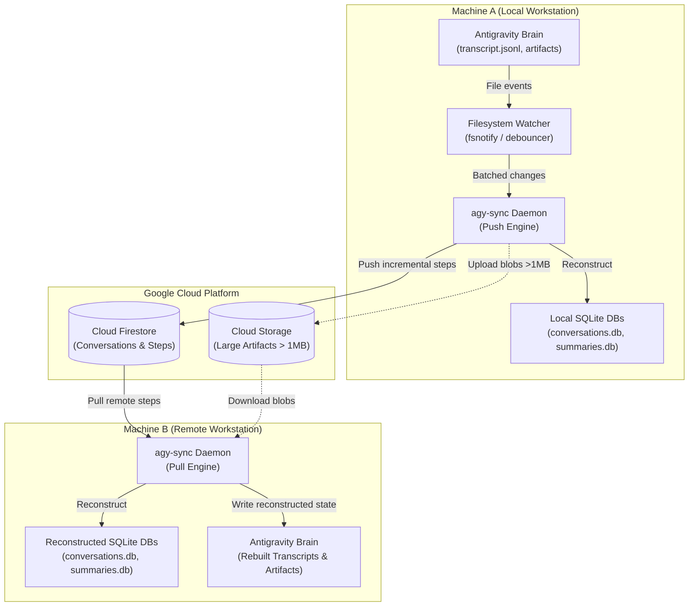

# agy-sync Documentation Hub

Welcome to the **`agy-sync`** documentation hub. This library provides comprehensive, topic-focused reference guides detailing the internal architecture, CLI tooling, synchronization mechanics, background daemon operations, and cloud diagnostics for synchronizing Google Antigravity (AGY) sessions across workstations.

---

## Documentation Index

| Guide | Description | Key Topics |
| :--- | :--- | :--- |
| **[Synchronization Engine](./sync.md)** | Bidirectional sync engine mechanics | Push/Pull, SQLite reconstruction, conflict resolution, step trajectories |
| **[Background Daemon & TUI](./daemon.md)** | Daemon lifecycle, filesystem watcher, and TUI pager | `start`, `stop`, `status`, `--full` interactive pager, PID/state tracking |
| **[Cloud Setup & Diagnostics](./setup-and-cloud.md)** | GCP authentication and automated provisioning | `setup` command, Application Default Credentials (ADC), Firestore check, dry run |
| **[Transactions & DB Operations](./transactions-and-db.md)** | Audit logging and database cleanup | `transactions` inspection, filtering, `clear` command with safety safeguards |

---

## High-Level Architecture

`agy-sync` bridges local Google Antigravity workspaces (`~/.gemini/antigravity-cli/brain/`) and Google Cloud Firestore, enabling asynchronous, multi-machine collaboration without data loss.

---

## Core Concepts & Data Entities

- **Brain Directory (`brain_dir`)**: The root storage directory managed by Google Antigravity (typically `~/.gemini/antigravity-cli/brain/`). Each conversation session is a subdirectory bearing a UUID.
- **Transcript (`transcript.jsonl`)**: JSON Lines file recording chronological execution steps, agent thoughts, user prompts, and tool calls.
- **Artifacts**: Files, diffs, images, or scratch files generated by Antigravity during pair-programming sessions.
- **Machine ID (`machine_id`)**: A unique identifier per workstation (e.g., `workstation-macbook`, `dev-desktop`) tagged to every pushed entity to prevent feedback/echo loops during bidirectional synchronization.
- **Reconstruction Engine**: A subsystem that reconstructs SQLite databases (`conversations.db` and `conversation_summaries.db`) so local Antigravity CLI and UI components can seamlessly discover and load synchronized sessions.
