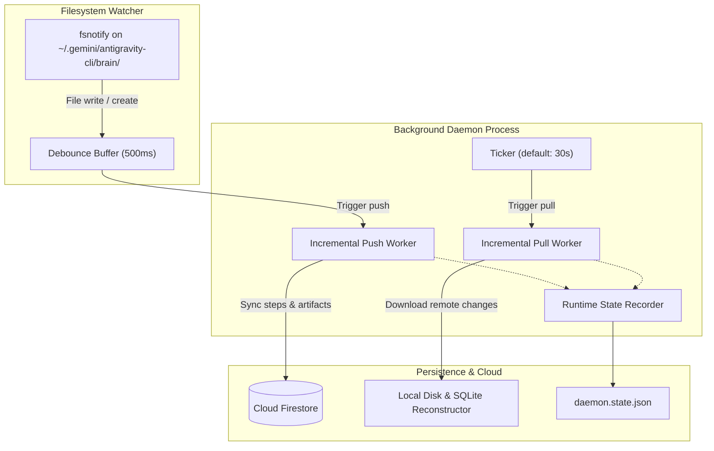

# Background Daemon & Terminal Viewport

The **`agy-sync` background daemon** continuously monitors your local Google Antigravity workspaces for file changes, debounces rapid edits, pushes incremental updates to Firestore, and periodically polls for updates originating from other machines.

---

## Daemon Architecture

When started, the daemon decouples from the active terminal and runs as a persistent background process governed by three runtime files:

1. **PID File (`daemon.pid`)**: Records the operating system process ID of the active daemon to prevent duplicate instances and coordinate graceful shutdowns.
2. **Log File (`daemon.log`)**: Captures real-time structured logs of ingestion events, network calls, errors, and pull operations.
3. **State File (`daemon.state.json`)**: Persists runtime metrics, including timestamps for the last local poll and remote pull.



---

## Daemon Management Commands

### 1. Starting the Daemon (`agy-sync start`)

Spawns the background daemon process if it is not already running.

```bash
# Start daemon with default configuration
agy-sync start

# Start with custom polling interval and state locations
agy-sync start \
  --poll-interval 15s \
  --log-file /tmp/agy-sync.log \
  --pid-file /tmp/agy-sync.pid \
  --state-file /tmp/agy-sync.state.json
```

#### Flags
| Flag | Description | Default |
| :--- | :--- | :--- |
| `--poll-interval` | Interval between remote Firestore pull checks | `30s` |
| `--pid-file` | Path to store daemon process ID | `~/.gemini/antigravity-cli/daemon.pid` |
| `--log-file` | Path to daemon output log | `~/.gemini/antigravity-cli/daemon.log` |
| `--state-file` | Path to daemon runtime state file | `~/.gemini/antigravity-cli/daemon.state.json` |

---

### 2. Stopping the Daemon (`agy-sync stop`)

Sends a termination signal (`SIGTERM`) to the running daemon and waits for clean shutdown. If the process does not terminate within the specified timeout, it is forcefully killed (`SIGKILL`).

```bash
# Stop running daemon gracefully
agy-sync stop

# Stop with custom timeout
agy-sync stop --timeout 10s
```

#### Flags
| Flag | Description | Default |
| :--- | :--- | :--- |
| `--timeout` | Duration to wait for graceful exit before forceful kill | `5s` |
| `--pid-file` | Path to daemon process ID file | `~/.gemini/antigravity-cli/daemon.pid` |

---

### 3. Checking Daemon Status (`agy-sync status`)

The `status` command provides a health check and overview of local sessions, cloud synchronization status, and daemon activity.

#### Default Compact Overview
By default, `agy-sync status` produces a compact summary designed for fast terminal checks:

```bash
agy-sync status
```

**Output:**
```
==================================================
              Antigravity Sync Status             
==================================================

Daemon Information:
  State:           RUNNING
  Process ID:      48215
  Last Poll:       2026-09-19 10:15:30 (12s ago)
  Log File:        /Users/dev/.gemini/antigravity-cli/daemon.log

Cloud Configuration:
  Project ID:      my-gcp-project
  Database ID:     (default)
  Machine ID:      macbook-pro

Sessions Overview:
  Sessions Found:  24
  Run 'agy-sync status --full' to inspect conversations.
==================================================
```

#### JSON Output Mode (`--json`)
Structured JSON is supported for tooling and automation. Unless `--full` is specified, the `conversations` array is omitted to keep the payload lightweight:

```bash
agy-sync status --json
```

---

## Interactive Terminal Viewport Pager (`--full`)

When running in an interactive terminal (TTY), passing the `--full` flag launches an interactive full-screen TUI pager:

```bash
agy-sync status --full
```

### Key Features of the Pager
- **Dynamic Viewport Height**: Automatically calculates page size based on current terminal window dimensions minus header/summary overhead.
- **Auto-Recalibration on Resize**: Dynamically recalculates page size when terminal windows are resized, keeping the current cursor item in view.
- **Raw Mode CRLF Normalization**: Guarantees zero text staircasing and pristine column alignment across terminal emulators.
- **Visual Cursor Selection**: Highlights the active item with `>` and aligned indentation.
- **Piping & Non-TTY Fallback**: Automatically streams tabular data directly without interactive paging when run in CI/CD or piped (`| grep`, `| cat`).

### Keyboard Navigation Reference

| Key(s) | Action |
| :--- | :--- |
| `↓` or `j` | Move selection down one row |
| `↑` or `k` | Move selection up one row |
| `→` or `l` or `Space` | Next page |
| `←` or `h` | Previous page |
| `PageDown` or `Ctrl+F` | Jump forward one page |
| `PageUp` or `Ctrl+B` | Jump backward one page |
| `Home` or `g` | Jump to very first item |
| `End` or `G` | Jump to very last item |
| `q` or `Esc` or `Ctrl+C` | Exit pager and restore terminal |
