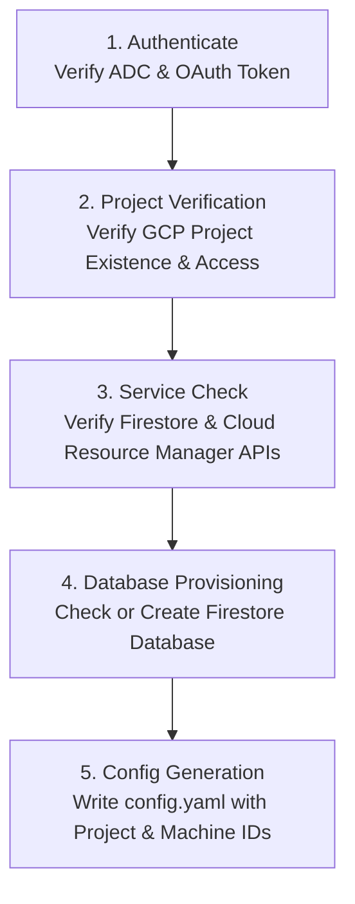

# Cloud Setup, Authentication & Diagnostics

`agy-sync` relies on Google Cloud Platform (GCP) for cloud storage and Firestore synchronization. The `setup` command provides an interactive diagnostic and automated provisioning pipeline to verify prerequisites, check IAM credentials, enable necessary Google Cloud APIs, and provision your Firestore database.

---

## Prerequisites

Before running `agy-sync`, ensure you have:
1. A Google Cloud project with billing enabled.
2. The Google Cloud CLI (`gcloud`) installed on your workstation.
3. Application Default Credentials (ADC) configured locally:
   ```bash
   gcloud auth application-default login
   ```

> [!NOTE]
> `agy-sync` authenticates using standard Google Cloud Application Default Credentials (ADC). It will search your local environment for credentials configured via `gcloud`, the `GOOGLE_APPLICATION_CREDENTIALS` environment variable, or compute instance metadata.

---

## Automated Setup Wizard (`agy-sync setup`)

The `setup` command runs an end-to-end diagnostic and provisioning suite against your GCP project.

```bash
# Run interactive setup and provisioning
agy-sync setup --project my-gcp-project

# Run safe non-mutating check (dry-run mode)
agy-sync setup --project my-gcp-project --dry-run
```



### Setup Pipeline Stages

1. **Authentication Check**: Validates that Google Cloud ADC credentials exist and can acquire a valid access token.
2. **Project Access Check**: Queries the Google Cloud Resource Manager API to ensure the authenticated identity has access to the specified project ID.
3. **API Enablement**:
   - Checks if `firestore.googleapis.com` is active.
   - If missing and `--dry-run` is not active, prompts or automatically enables the service via the Google Service Usage API.
4. **Database Provisioning**:
   - Inspects the project for a Firestore database in Native mode (default: `(default)`).
   - If the database does not exist and `--dry-run` is false, provisions the database in your preferred GCP region (e.g., `us-central1` or `europe-west1`).
5. **Configuration Generation**: Generates or updates your local configuration file (`config.yaml`), recording the project ID, database ID, and a uniquely generated `machine_id`.

---

## Setup Flags

| Flag | Description | Default |
| :--- | :--- | :--- |
| `--project` | Target Google Cloud Project ID | (Prompted or from config) |
| `--database` | Firestore database ID to verify or provision | `(default)` |
| `--region` | Cloud region for new Firestore database | `us-central1` |
| `--dry-run` | Run all checks without enabling APIs or creating databases | `false` |
| `--config` | Custom destination path for `config.yaml` | `~/.gemini/antigravity-cli/config.yaml` |

---

## Sample Diagnostic Outputs

### Standard Diagnostic Run
```
[1/5] Checking Google Cloud authentication...
      ✓ Application Default Credentials found (developer@example.com)
[2/5] Checking project access for 'my-gcp-project'...
      ✓ Project is active and accessible
[3/5] Verifying required Google Cloud APIs...
      ✓ firestore.googleapis.com is enabled
      ✓ serviceusage.googleapis.com is enabled
[4/5] Checking Firestore database '(default)'...
      ✓ Database exists in region 'us-central1' (type: FIRESTORE_NATIVE)
[5/5] Updating local configuration...
      ✓ Configuration written to /Users/dev/.gemini/antigravity-cli/config.yaml

Setup complete! You can now start syncing with 'agy-sync start'.
```

### Dry-Run Diagnostics
```bash
agy-sync setup --project my-gcp-project --dry-run
```
```
[DRY RUN] Verifying Google Cloud prerequisites without applying changes...
[1/4] Auth: ✓ Valid credentials
[2/4] Project: ✓ 'my-gcp-project' accessible
[3/4] APIs: ✓ Required services enabled
[4/4] Database: ✓ Firestore '(default)' is ready
All checks passed! No modifications were made.
```

---

## Required IAM Permissions

For complete automated setup, the authenticated Google account requires:
- `roles/datastore.user` (or `roles/datastore.owner` for automated database creation).
- `roles/serviceusage.serviceUsageAdmin` (if automated API enablement is needed).
- `roles/resourcemanager.projectViewer` (to verify project state).
