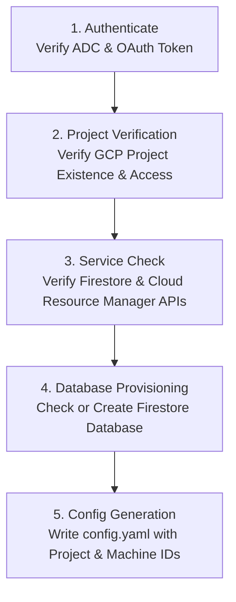

# Cloud Setup, Authentication & Diagnostics

`agy-sync` relies on Google Cloud Platform (GCP) for cloud storage and Firestore synchronization. The `setup` command provides an interactive diagnostic and automated provisioning pipeline to verify prerequisites, check IAM credentials, enable necessary Google Cloud APIs, and provision your Firestore database.

---

## Prerequisites

Before running `agy-sync`, ensure you have:
1. A Google Cloud project with billing enabled.
2. The Google Cloud CLI (`gcloud`) installed on your workstation.
3. Application Default Credentials (ADC) configured locally:
   ```bash
   gcloud auth application-default login
   ```

> [!NOTE]
> `agy-sync` authenticates using standard Google Cloud Application Default Credentials (ADC). It will search your local environment for credentials configured via `gcloud`, the `GOOGLE_APPLICATION_CREDENTIALS` environment variable, or compute instance metadata.

---

## Automated Setup Wizard (`agy-sync setup`)

The `setup` command runs an end-to-end diagnostic and provisioning suite against your GCP project.

```bash
# Run interactive setup and provisioning
agy-sync setup --project-id my-gcp-project

# Run safe non-mutating check (dry-run mode)
agy-sync setup --project-id my-gcp-project --dry-run

# Run non-interactively with auto-approval (CI/CD)
agy-sync setup --project-id my-gcp-project --yes
```



### Setup Pipeline Stages

1. **Authentication Check**: Validates that Google Cloud ADC credentials exist and can acquire a valid access token.
2. **Project Access Check**: Queries the Google Cloud Resource Manager API to ensure the authenticated identity has access to the specified project ID.
3. **API Enablement**:
   - Checks if `firestore.googleapis.com` is active.
   - If missing and `--dry-run` is not active, prompts or automatically enables the service via the Google Service Usage API.
4. **Database Provisioning**:
   - Inspects the project for a Firestore database in Native mode (default: `(default)`).
   - If the database does not exist and `--dry-run` is false, provisions the database in your preferred GCP region (default: `nam5`).
5. **Configuration Generation**: Generates or updates your local configuration file (`config.yaml`), recording the project ID, database ID, and a uniquely generated `machine_id`.

---

## Setup Flags

| Flag | Short | Description | Default |
| :--- | :--- | :--- | :--- |
| `--project-id` | | Target Google Cloud Project ID | (From config or prompt) |
| `--database-id` | | Firestore database ID to verify or provision | `(default)` |
| `--location` | | Cloud region for new Firestore database | `nam5` |
| `--dry-run` | | Inspect environment and cloud resources without making changes | `false` |
| `--yes` | `-y` | Automatically confirm database creation without interactive prompting | `false` |
| `--config` | | Custom destination path for `config.yaml` | `~/.config/agy-sync/config.yaml` |
| `--json` | | Output full diagnostic report formatted as JSON | `false` |

---

## Sample Diagnostic Outputs

### Standard Diagnostic Run
```text
AGY-SYNC ENVIRONMENT & CLOUD SETUP
==================================
Target Project:  my-gcp-project
Target Database: (default)
Execution Mode:  Live Mode

DIAGNOSTIC CHECKS:
  [✓] Google Cloud Authentication (ADC) (14ms)
      Active credentials found (developer@example.com)
  [✓] Google Cloud Project Access (42ms)
      Project "my-gcp-project" accessible
  [✓] Required Cloud APIs (112ms)
      All required service APIs are enabled
      • firestore.googleapis.com: enabled
      • cloudresourcemanager.googleapis.com: enabled
      • storage.googleapis.com: enabled
  [✓] Firestore Database Access (78ms)
      Database "(default)" ready
  [✓] Google Cloud Storage Access (31ms)
      Cloud Storage API and permissions verified
  [✓] Local Environment & Configuration (2ms)
      Local directories and configuration accessible

==================================
STATUS: ALL CHECKS PASSED
Ready to run 'agy-sync start' or 'agy-sync push'.
```

### Dry-Run Diagnostics
```bash
agy-sync setup --project-id my-gcp-project --dry-run
```
```text
AGY-SYNC ENVIRONMENT & CLOUD SETUP
==================================
Target Project:  my-gcp-project
Target Database: (default)
Execution Mode:  Dry Run (Inspection Only)

DIAGNOSTIC CHECKS:
  [✓] Google Cloud Authentication (ADC) (12ms)
      Active credentials found (developer@example.com)
  [✓] Google Cloud Project Access (38ms)
      Project "my-gcp-project" accessible
  [✓] Required Cloud APIs (95ms)
      All required service APIs are enabled
  [✓] Firestore Database Access (65ms)
      Database "(default)" ready
  [✓] Google Cloud Storage Access (28ms)
      Cloud Storage API and permissions verified
  [✓] Local Environment & Configuration (2ms)
      Local directories and configuration accessible

==================================
STATUS: ALL CHECKS PASSED
Ready to run 'agy-sync start' or 'agy-sync push'.
```

---

## Required IAM Permissions

For complete automated setup, the authenticated Google account requires:
- `roles/datastore.user` (or `roles/datastore.owner` for automated database creation).
- `roles/serviceusage.serviceUsageAdmin` (if automated API enablement is needed).
- `roles/resourcemanager.projectViewer` (to verify project state).
