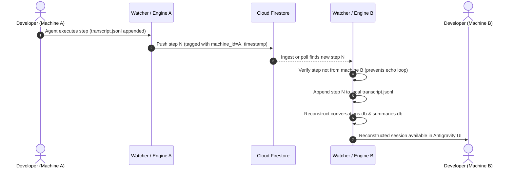

# Synchronization Engine

The **Synchronization Engine** is the core component of `agy-sync`. It provides deterministic, bidirectional synchronization of Antigravity conversations, transcripts, steps, and artifacts between local developer workstations and Google Cloud Firestore.

---

## Architecture & Conflict-Free Model

Antigravity sessions produce an append-only timeline of conversation steps (`USER_INPUT`, `PLANNER_RESPONSE`, tool executions). `agy-sync` models synchronization around immutable append-only events rather than destructive state overwrites:



### Key Principles

1. **Machine Identification (`machine_id`)**:
   Every machine has a designated `machine_id` in `config.yaml`. Pushed steps and metadata documents store the origin `machine_id`. When pulling, machines filter out changes originating from themselves, preventing echo and infinite synchronization loops.
2. **Deterministic Step Ordering**:
   Steps contain an explicit zero-indexed `step_index`. When pulling or pushing, steps are sorted and merged by `step_index` and timestamp, ensuring parity across workstations.
3. **Selective Sync**:
   While the background daemon syncs everything continuously, developers can target individual conversations on demand using `--conversation <id>`.

---

## SQLite Database Reconstruction

Antigravity stores local conversation indices and trajectory steps across two SQLite databases:

1. **`conversation_summaries.db`**:
   - Location: `<appDataDir>/conversations/conversation_summaries.db`
   - Table: `conversation_summaries`
   - Fields: `conversation_id`, `title`, `created_at`, `updated_at`, `total_steps`, `token_count`, `cost`, `pinned`, etc. (all 21 schema columns supported).
2. **Session-Specific `conversations.db`**:
   - Location: `<appDataDir>/brain/<conversation-id>/conversations.db`
   - Tables:
     - `conversations`: Primary record of the conversation session.
     - `steps`: Step index, role, timestamp, tool executions.
     - `trajectories`: Step details, model thoughts, planner actions, media URIs.

When pulling remote conversations, `agy-sync`'s `reconstructor` engine rebuilds these SQLite files on the fly. This ensures that the Antigravity desktop IDE, CLI history, and session resume capabilities work seamlessly as if the session had taken place locally.

---

## CLI Commands

### 1. Push Local State (`agy-sync push`)

Uploads local conversation steps, transcripts, and artifacts to Firestore.

```bash
# Push all local conversations to Firestore
agy-sync push

# Push only a specific conversation
agy-sync push --conversation 624296c6-d623-4c39-92d4-3906f8c07140

# Push and return structured JSON
agy-sync push --json
```

#### Flags
| Flag | Short | Description |
| :--- | :--- | :--- |
| `--conversation` | `-c` | Specific conversation UUID to push |
| `--json` | | Output result formatted as JSON |
| `--config` | | Custom path to `config.yaml` |

#### Sample Terminal Output
```
Starting sync push to Firestore...
Sync push complete: 3 conversations, 42 steps, 8 artifacts pushed.
```

---

### 2. Pull Remote State (`agy-sync pull`)

Fetches remote conversations and steps from Firestore and reconstructs local transcripts, artifacts, and SQLite databases.

```bash
# Pull all remote conversations and update local SQLite databases
agy-sync pull

# Pull a single conversation session
agy-sync pull --conversation 624296c6-d623-4c39-92d4-3906f8c07140

# Pull in JSON mode
agy-sync pull --json
```

#### Flags
| Flag | Short | Description |
| :--- | :--- | :--- |
| `--conversation` | `-c` | Specific conversation UUID to pull |
| `--json` | | Output pull statistics in JSON |
| `--config` | | Custom path to `config.yaml` |

#### Sample Terminal Output
```
Starting sync pull from Firestore...
Pull complete: 2 conversations updated, 14 steps pulled, 3 artifacts pulled.
Reconstructed SQLite database for 624296c6-d623-4c39-92d4-3906f8c07140 (14 steps)
```

---

## Artifact Handling

Antigravity artifacts (plans, code diffs, markdown summaries, images) are stored within `<appDataDir>/brain/<conversation-id>/`:

- **Small Artifacts (<= 1MB)**: Serialized directly as encoded payload documents within the Firestore sub-collection `conversations/{id}/artifacts/{name}`.
- **Large Artifacts (> 1MB)**: Uploaded to a configured Google Cloud Storage (GCS) bucket, with Firestore retaining the reference URI and digest hash. On remote pull, the blob is downloaded and written back to disk with matching file permissions.
